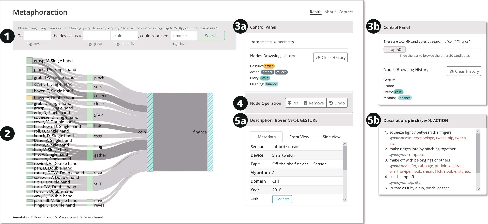

## Metaphoraction
> Support Gesture-based Interaction Design with Metaphorical Meanings

Zhida Sun, Sitong Wang, Chengzhong Liu, and Xiaojuan Ma, Metaphoraction: Support Gesture-based Interaction Design with Metaphorical Meanings, ACM Transactions on Computer-Human Interaction (ToCHI), 2022



<br />

### How to use the project?

1. This repository contains the following contents:
    1. README.pdf: a brief introduction of Metaphoraction
    2. requirements.txt: the project dependencies are listed in this file
    3. run.py: the file used to start the server
    4. database.db: the database to store the design pathways
    5. app: the frontend and the server of Metaphoraction
    6. [P1]_dependencies_setting_guideline.pdf: a brief instruction on how to set up the environment for Metaphoraction

2. Set up python environment on your local computer: Please follow (f) if you have not installed python environment (>=3.6) in your local machine; if you have already deployed python environment (>=3.6), you can simply install project dependencies by typing the following command under the project path ./metaphoraction:

    ```bash
    $pip install -r requirements.txt
    ```


3. Download the WordNet dataset: After installing all the required packages, you still need one more step to install the WordNet dataset if you never used the dataset before.

    ```python
     >>> import nltk
     >>> nltk.download('wordnet')
    ```


4. Experience Metaphoraction: After installing all the dependencies, please go to the ./metaphoraction and start the server by

    ```bash
    $python app.py
    ```

    If everything is OK, you will see that the app is running on `http://0.0.0.0:5000/`
    Then you can type the link `http://127.0.0.1:5000/` to your local web browser (Chrome recommended) to explore Metaphoraction.

5. Please feel free to leave comments on your experience when using Metaphoraction or any suggestions to improve this tool.
You are also welcome to contribute your code by modifying or adding functions to Metaphoraction.
Please note that do not spread the code outside the class because this tool is currently under review.

### Support or Contact

Having trouble with the code? Check out our [paper]()/[project page](https://zhdsun.github.io/projects/mim/) or [contact the author](sunzhida@outlook.com).
